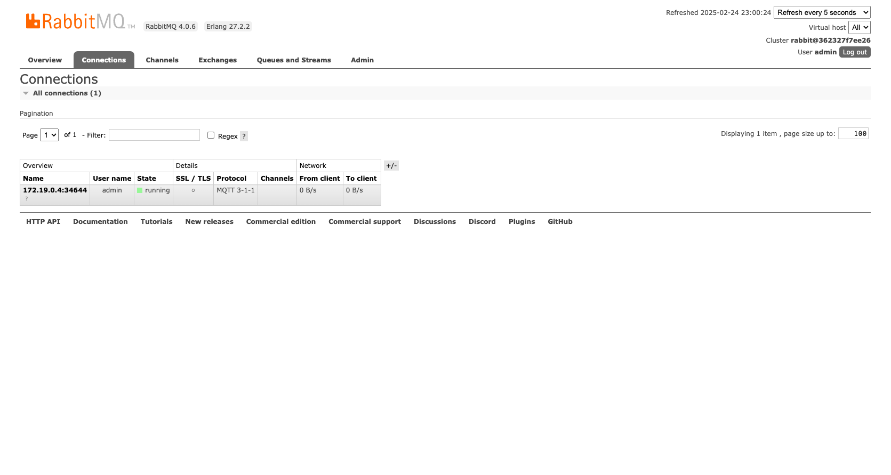

# Description
Maiind mongoDB, node-RED and RabbitMQ custom services deployed as Docker Containers locally and published in your private docker-hub rspository.

- The mongoDB service include:
    - Standalone mondoDB with Basic Security credentials: **admin/password**
    - Sample Database.
    - Sample Collection with some Documents.

- The node-red service include:
    - Securized with basic credentials: **admin/password**.
    - With [node-red-node-mongodb](https://flows.nodered.org/node/node-red-node-mongodb) and [node-red-dashboard](https://flows.nodered.org/node/node-red-dashboard) nodes just installed.
    - With a simple flow called **Greeting Flow**.

- The RabbitMQ service include:
    - Securized with basic credentials: **admin/password**.
    - With MQTT Plugin activated

# Steps 
Follow the next steps to build an run your custom mongodb and node-red services.

### STEP01: Create a network maiind
```
$ docker network create maiind
```

### STEP02: Build your custom mongo image
 ```
$ docker build -t maiind-mongo:1.0.0 .
 ```

 ### STEP03: Start your custom mongodb container in the network maiind
 ```
 $ docker run \
 -d \
 --name maiind-mongo \
 --network maiind \
 -p 27017:27017 \
 -e MONGO_INITDB_ROOT_USERNAME=admin \
 -e MONGO_INITDB_ROOT_PASSWORD=password \
 -e MONGO_INITDB_DATABASE=maiind \
 -v mongo_data:/data/db \
 maiind-mongo:1.0.0
 ```

We can use the Open source mongoDB manager called [MongoDB Compass](https://www.mongodb.com/products/tools/compass)

 

 

 ### STEP04: Tag your custom mongo docker image to be published in your docker-hub private repository
```
$ docker tag maiind-mongo:1.0.0 ofertoio/maiind-mongo:1.0.0
 ```

### STEP05: Publish your custom mongo docker image in your private repository to be shared
Previous to publish in your docker-hub respository you must login inside like this:
 ```
$ docker login
 ```

Then you can publish your image:

 ```
$ docker push ofertoio/maiind-mongo:1.0.0
 ```

### STEP06: start a sample node-red to get the settings.js file and create an admin password
 ```
$ docker run -d --rm --name node-red nodered/node-red
 ```

login inside  and execute this command to create the default **admin** password: **password**
 ```
$ docker exec -it node-red bash
$ node-red admin hash-pw
 ```

from host copy the settings.js file 
 ```
$ docker cp node-red:/data/settings.js ./
 ```

stop the sample node-red. Docker will removed it automatically
```
$ docker stop node-red
```

### STEP07: Build your custom node-red docker image
 ```
$ docker build -t maiind-node-red:4.0.0 .
 ```

### STEP08: Start your custom node-red docker container in the network maiind
 ```
$ docker run \
-d \
--name maiind-node-red \
--network maiind \
-p 1880:1880 \
-v node_red_data:/data \
maiind-node-red:4.0.0
```

Now we can open the node-RED UI Console from [http://localhost:1880](http://localhost:1880) with credentials **admin/password**


**NOTE**: the mongodb flows imported by the image not set the mongo credentials by security. You must set after login inside node-RED

### STEP09: Tag your custom node-red docker image to be published in your docker-hub private repository
```
$ docker tag maiind-node-red:4.0.0 ofertoio/maiind-node-red:4.0.0
 ```

### STEP10: Publish your custom node-red docker image in your private repository to be shared
 ```
$ docker push ofertoio/maiind-node-red:4.0.0
 ```

### STEP011: Build your custom rabbitmq docker image
 ```
$ docker build -t maiind-rabbitmq:1.0.0 .
 ```

 ### STEP12: Start your rabbitmq docker container in the network maiind
  ```
$ docker run \
-d \
--name maiind-rabbitmq \
--network maiind \
-p 5672:5672 \
-p 15672:15672 \
-e RABBITMQ_DEFAULT_USER=admin \
-e RABBITMQ_DEFAULT_PASS=password \
maiind-rabbitmq:1.0.0
 ```

Now we can open the RabbitMQ Management Console from [http://localhost:15672](http://localhost:15672) with credentials **admin/password**



### STEP13: Build your custom rabbitmq docker image
 ```
$ docker tag maiind-rabbitmq:1.0.0 ofertoio/maiind-rabbitmq:1.0.0 .
 ```

### STEP14: Publish your custom rabbitmq docker image in your private repository to be shared
 ```
$ docker push ofertoio/maiind-rabbitmq:1.0.0
 ```
